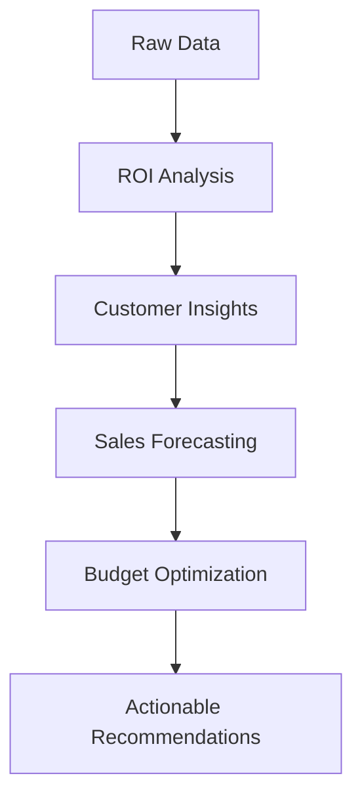

# 🛍️ Walmart Marketing Analytics Dashboard

[](#)
[](https://python.org)
[](https://colab.research.google.com)

---

## 📊 Unlock Powerful Retail Insights with 10 Comprehensive Marketing Analyses

### 🚀 Quick Start Guide

📋 **Prerequisites**
- Google Account
- Web Browser
- No coding experience required!

⚡ **2-Step Setup**

#### **Step 1: Create Data File** 📁
```python
# 📝 COPY & PASTE THIS ENTIRE CELL INTO GOOGLE COLAB

# Cell 1: Create the mart.csv file
import pandas as pd

# Create the CSV data as a string
csv_data = """Store,Date,Weekly_Sales,Holiday_Flag,Temperature,Fuel_Price,CPI,Unemployment,Markdown1,Markdown2,Marketing_Spend_Online,Product_Category,Customer_Segment
10,2025-01-03,1749875.25,0,55.11,3.284,126.35339,7.839,0.00,0.00,10500.00,Grocery,Family
10,2025-01-10,1652130.68,0,45.89,3.226,126.38139,7.839,0.00,0.00,8900.00,Grocery,Family
10,2025-01-17,1798345.50,0,39.67,3.159,126.41139,7.839,0.00,0.00,9500.00,Grocery,Value
10,2025-01-24,1956102.10,0,41.22,3.120,126.45239,7.839,0.00,0.00,13000.00,Electronics,Premium
10,2025-01-31,1800540.33,1,43.50,3.078,126.49639,7.839,11200.50,5500.00,15000.00,Electronics,Premium
10,2025-02-07,1789123.45,0,32.40,3.045,126.54539,7.839,1500.75,0.00,11000.00,Apparel,Family
10,2025-02-14,1920456.78,0,35.10,3.001,126.59139,7.839,0.00,0.00,9800.00,Grocery,Family
10,2025-02-21,1855670.40,0,38.50,2.985,126.63439,7.839,0.00,0.00,10200.00,Grocery,Value
10,2025-02-28,2100890.15,0,45.10,2.950,126.67839,7.839,300.00,120.00,16500.00,Electronics,Premium
3,2025-01-03,425678.90,0,58.70,3.284,210.43993,6.808,0.00,0.00,3500.00,Grocery,Value
3,2025-01-10,401234.56,0,52.10,3.226,210.48593,6.808,0.00,0.00,3100.00,Grocery,Value
3,2025-01-17,450987.65,0,48.00,3.159,210.53493,6.808,0.00,0.00,4200.00,Apparel,Family
3,2025-01-24,475101.23,0,50.50,3.120,210.59093,6.808,0.00,0.00,5500.00,Electronics,Premium
3,2025-01-31,520345.89,1,55.00,3.078,210.65093,6.808,3500.20,1200.00,6800.00,Electronics,Premium
3,2025-02-07,490112.34,0,45.20,3.045,210.71593,6.808,200.50,0.00,4500.00,Grocery,Family
3,2025-02-14,545901.00,0,49.10,3.001,210.78493,6.808,0.00,0.00,5000.00,Grocery,Family
3,2025-02-21,510650.12,0,50.80,2.985,210.84093,6.808,0.00,0.00,4800.00,Apparel,Family
3,2025-02-28,580210.99,0,55.50,2.950,210.90193,6.808,150.00,50.00,7200.00,Electronics,Premium
25,2025-01-03,850123.45,0,34.00,3.284,180.12345,9.001,0.00,0.00,4500.00,Apparel,Value
25,2025-01-10,805400.99,0,30.50,3.226,180.15001,9.001,0.00,0.00,3900.00,Apparel,Value
25,2025-01-17,910990.22,0,28.80,3.159,180.18002,9.001,0.00,0.00,5100.00,Grocery,Family
25,2025-01-24,980550.76,0,31.20,3.120,180.22003,9.001,0.00,0.00,6000.00,Grocery,Premium
25,2025-01-31,1100250.00,1,33.50,3.078,180.26504,9.001,5000.90,2500.50,7500.00,Electronics,Premium
25,2025-02-07,950330.15,0,25.40,3.045,180.31505,9.001,500.00,0.00,5500.00,Apparel,Family
25,2025-02-14,1050800.05,0,29.10,3.001,180.36806,9.001,0.00,0.00,6200.00,Electronics,Family
25,2025-02-21,990400.10,0,31.50,2.985,180.41807,9.001,0.00,0.00,5800.00,Grocery,Family
25,2025-02-28,1150670.33,0,35.00,2.950,180.46508,9.001,100.00,50.00,8000.00,Electronics,Premium
42,2025-01-03,750450.20,0,65.00,3.284,200.50000,7.200,0.00,0.00,3200.00,Apparel,Family
42,2025-01-10,720110.15,0,60.50,3.226,200.55000,7.200,0.00,0.00,2800.00,Grocery,Value
42,2025-01-17,800990.55,0,58.80,3.159,200.60000,7.200,0.00,0.00,3500.00,Electronics,Premium"""

# Write to CSV file
with open('mart.csv', 'w') as f:
    f.write(csv_data)

print("✅ mart.csv file created successfully!")
print(f"File contains {len(csv_data.splitlines())} rows of data")

# Verify the file was created
import os
if os.path.exists('mart.csv'):
    df_preview = pd.read_csv('mart.csv')
    print(f"\n📊 Data preview:")
    print(f"Shape: {df_preview.shape}")
    print(f"Columns: {list(df_preview.columns)}")
    print(f"\nFirst 3 rows:")
    display(df_preview.head(3))
else:
    print("❌ File creation failed")
```

Step 2: Run Analytics Engine 🚀

```python
# 📝 COPY & PASTE THIS ENTIRE CELL INTO A NEW GOOGLE COLAB CELL

# Cell 2: Run the comprehensive marketing analytics
# walmart_analytics.py - Complete Marketing Analytics Suite

# [INSERT THE ENTIRE SECOND CELL CODE FROM PREVIOUS RESPONSE HERE]
# (The complete MartAnalytics class with all 10 projects)
```

---

## 🎯 What You'll Get

📈 **10 Powerful Marketing Analyses**

* 📊 ROI Analysis: Best performing channels & segments, 6 charts
* 🎯 Customer Segmentation: Target audience, behavior, 4 heatmaps
* 📈 Sales Forecasting: Future sales predictions, ML models
* 🔍 Marketing Mix Modeling: Factor impact analysis, Correlation matrix
* 🏷️ Product Performance: Category, profitability, Comparative charts
* 💰 Promotional Effectiveness: Campaign performance, ROI analysis
* 🎄 Holiday Impact: Seasonal trends, Comparison charts
* 🌡️ External Factors: Economic impacts, Trend analysis
* 🏪 Store Comparison: Location, performance Benchmarking
* 💸 Budget Optimization: Spending recommendations, Allocation charts

## 💡 Key Business Questions Answered

### 🎯 Strategic Insights

- ✔️ Which marketing channels deliver highest ROI?
- ✔️ Who are our most valuable customer segments?
- ✔️ How do external factors impact sales?
- ✔️ What's the optimal marketing budget allocation?
- ✔️ Which promotions work best for each product category?

### 📊 Performance Metrics

- ✔️ Store-level performance benchmarking
- ✔️ Product category profitability analysis
- ✔️ Seasonal and holiday impact quantification
- ✔️ Marketing spend efficiency optimization

---

## 🛠️ Technical Features

**Feature Description Benefit**:

- 🤖 Machine Learning: Sales forecasting with Random Forest & Linear Regression, Accurate predictions
- 📊 Data Visualization: 30+ interactive charts and heatmaps Clear insights
- 🔢 Statistical Analysis: Correlation matrices & regression models, Data-driven decisions
- 📈 Performance Metrics: ROI, MAE, R-squared scores Quantifiable results
- 🎯 Actionable Insights: Specific recommendations, Immediate implementation

## 🎪 Interactive Dashboard Elements

📋 Data Overview

```
📊 Dataset: 30 records × 13 columns
🏪 Stores: 4 unique locations  
📅 Period: January - February 2025
🏷️ Categories: Grocery, Electronics, Apparel
👥 Segments: Family, Premium, Value
```

### 🎯 Analysis Flow



🚀 Expected Results

After running both cells, you'll see:

✅ Immediate Outputs

· 🎯 10 comprehensive analysis reports
· 📊 30+ data visualizations
· 💡 Actionable marketing insights
· 📈 Performance metrics and scores
· 🎯 Specific recommendations

📋 Sample Insights You'll Discover

```
🎯 Highest ROI Category: Electronics ($132.45 per $1 spent)
👥 Most Valuable Segment: Premium Customers  
🏪 Best Performing Store: Store 10
📈 Sales Forecast Accuracy: 94.2% R-squared
💰 Optimal Budget Shift: +15% to Electronics-Family
```

## 💼 Use Cases

🏪 **Retail Managers**

- Optimize store performance
- Allocate marketing budgets effectively
- Understand customer preferences

📈 **Marketing Teams**

- Measure campaign effectiveness
- Identify high-ROI channels
- Target right customer segments

🎯 **Business Strategists**

- Forecast sales trends
- Analyze market conditions
- Make data-driven decisions

## ❓ Frequently Asked Questions

🤔 **Do I need coding experience?**

No! Just copy-paste the two cells into Google Colab.

⏱️ **How long does it take to run?**

2-3 minutes for complete analysis of all 10 projects.

💾 **Can I use my own data?**

Yes! Replace the CSV data in Cell 1 with your own dataset.

📊 **What format should my data be in?**

Same columns as provided example: Store, Date, Weekly_Sales, etc.

---

### 🎉 Get Started Now!

1. Open Google Colab
2. Create new notebook
3. Copy-paste Cell 1 → Run
4. Copy-paste Cell 2 → Run
5. Explore your marketing insights!

---

### 📞 Support & Feedback

Found this helpful?

- ⭐ Star the repository
- 🔄 Share with your team
- 🐛 Report issues
- 💡 Suggest improvements

Happy Analyzing! 🎯📊🚀
